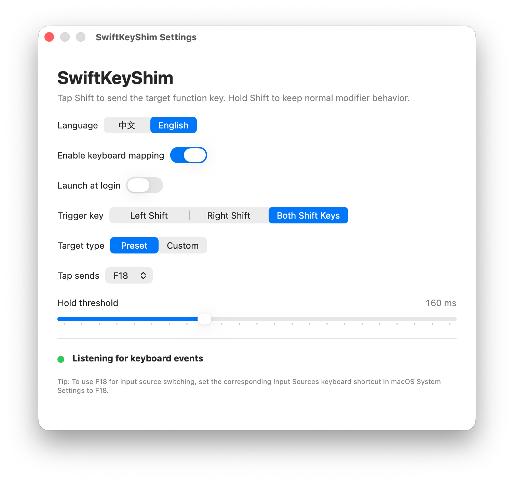

# SwiftKeyShim

[中文说明](README.zh-CN.md)

> Built through vibe coding with GPT-5.5 and OpenCode.

SwiftKeyShim is a small personal macOS menu bar app that remaps a quick tap of Shift to a function key. It is built with Swift and SwiftUI for my own keyboard workflow, so it intentionally focuses on a narrow set of needs rather than trying to be a general-purpose key remapper.

By default, tapping Left Shift sends F18. Holding Shift still works as a normal Shift modifier.



## Features

- Tap Left Shift to send F18 by default.
- Keep normal Shift behavior when the key is held.
- Choose Left Shift, Right Shift, or both Shift keys as the trigger.
- Send F17, F18, F19, or a custom macOS virtual key code.
- Adjust the tap/hold threshold.
- Enable or disable the remapping from the menu bar.
- Show abnormal status in the menu bar icon when remapping is enabled but the app is not listening correctly.
- Switch the app interface between English and Chinese.
- Start automatically at login.

## Requirements

- macOS 15.0 or later.
- Xcode for building from source.
- Accessibility permission for keyboard event monitoring and remapping.

## Usage

1. Open `SwiftKeyShim.xcodeproj` in Xcode.
2. Build and run the `SwiftKeyShim` scheme.
3. Grant Accessibility permission when macOS asks for it, or enable it manually in System Settings.
4. If you want F18 to switch input sources, set the input source shortcut to F18 in `System Settings -> Keyboard -> Keyboard Shortcuts -> Input Sources`.
5. Use the menu bar icon to open settings, enable or disable remapping, configure launch at login, or quit the app.

## Build

```sh
xcodebuild -project SwiftKeyShim.xcodeproj -scheme SwiftKeyShim -configuration Debug -destination 'platform=macOS,arch=arm64' build
```

## How It Works

SwiftKeyShim uses a macOS `CGEventTap` to listen for keyboard events. When the configured Shift key is pressed and released within the tap threshold, the app suppresses the original Shift tap and posts the configured target key with `CGEvent`. When Shift is held past the threshold or combined with another key, it is passed through as a normal modifier.

Synthetic events posted by SwiftKeyShim are marked so the app does not remap its own generated key events.

## Notes

- The app runs as a menu bar utility and does not show a Dock icon.
- This is a personal app built around my own input-source switching workflow. It may be useful to others, but it is not intended to cover every keyboard remapping use case.
- I made this instead of continuing with Karabiner because Karabiner is very powerful but its configuration felt too complex for this small need. I also kept running into unresolved bugs in my setup, and I was concerned about potential memory leak behavior.
- If remapping is enabled but Accessibility permission is missing or the event tap cannot run, the menu bar icon changes to `keyboard.badge.ellipsis`.
- Launch at login uses `SMAppService.mainApp`, so behavior may differ between a build launched from Xcode and an app installed in `/Applications`.

## License

SwiftKeyShim is released under the [MIT License](LICENSE).
