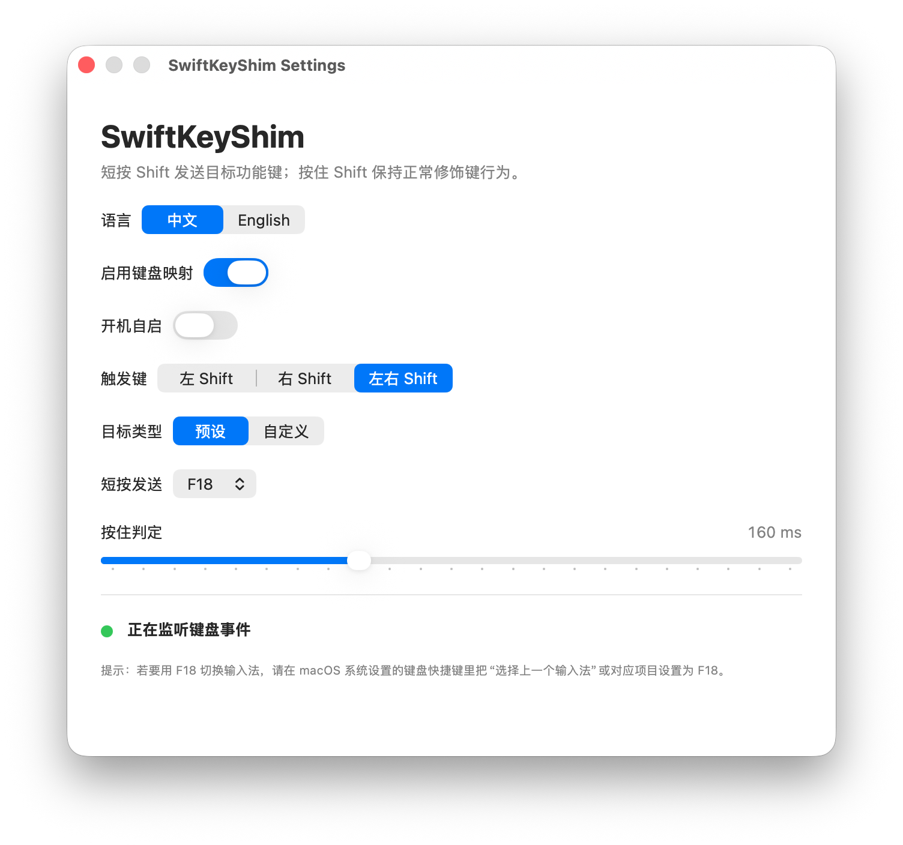

# SwiftKeyShim

[English](README.md)

> 由 GPT-5.5 / OpenCode Vibe Coding 而成。

SwiftKeyShim 是一个个人使用的 macOS 菜单栏键盘映射小程序，使用 Swift 和 SwiftUI 构建。它主要服务于我自己的键盘使用习惯，因此只专注于少量明确需求，而不是试图成为通用键盘映射工具。

默认行为：短按左 Shift 发送 F18；按住 Shift 时仍作为正常 Shift 修饰键使用。可选地将 ESC 与 Caps Lock 独立映射（含互换），MacBook 内置键盘指示灯会正确跟随。



## 功能

- 默认短按左 Shift 发送 F18。
- 按住 Shift 时保持正常 Shift 行为。
- 可选择左 Shift、右 Shift 或左右 Shift 作为触发键。
- 可发送 F17、F18、F19，或自定义 macOS virtual key code。
- 可调整短按和按住的判定阈值。
- 可选 **ESC → Caps Lock**、**Caps Lock → ESC**，两条映射可单独开启或同时开启（互换）。
- 可从菜单栏启用或停用映射。
- 映射已启用但 app 未正常监听时，菜单栏图标显示异常状态。
- 支持英文和中文界面切换。
- 支持开机自启。

## 要求

- macOS 15.0 或更高版本。
- 使用 Xcode 从源码构建。
- Shift 短按映射需要授予**辅助功能**权限（`CGEventTap`）。
- ESC / Caps Lock 映射通过系统 `hidutil` 写入 HID 层键位表；关闭映射或退出 app 时会自动清除。

## 使用

1. 用 Xcode 打开 `SwiftKeyShim.xcodeproj`。
2. 构建并运行 `SwiftKeyShim` scheme。
3. 首次运行时按 macOS 提示授予辅助功能权限，也可以在系统设置中手动开启。
4. 如果要让 F18 切换输入法，在 `系统设置 -> 键盘 -> 键盘快捷键 -> 输入源` 中把对应快捷键设置为 F18。
5. 在设置里按需打开 ESC / Caps Lock 映射；两条可独立开关。
6. 通过菜单栏图标打开设置、启用或停用映射、配置开机自启，或退出 app。

## 构建

```sh
xcodebuild -project SwiftKeyShim.xcodeproj -scheme SwiftKeyShim -configuration Debug -destination 'platform=macOS,arch=arm64' build
```

## 工作原理

SwiftKeyShim 用**两套机制**分别处理不同按键，而不是用同一种方式做完所有映射。

```
物理键盘
   │
   ▼
┌──────────────────────────────────┐
│  HID 层（hidutil UserKeyMapping） │  ← ESC / Caps Lock
│  在系统输入很早期改键码            │
└──────────────────────────────────┘
   │
   ▼
┌──────────────────────────────────┐
│  CGEventTap（会话层）             │  ← Shift 短按 / 长按
│  应用级拦截，可吞掉、改写、再注入  │
└──────────────────────────────────┘
   │
   ▼
应用 / 系统收到最终按键
```

### 1. ESC / Caps Lock：HID 层（`hidutil`）

实现：`HIDKeyMapper.swift`。

开启对应选项后，app 调用：

```sh
hidutil property --set '{"UserKeyMapping":[...]}'
```

写入系统 `UserKeyMapping`。键用 HID Keyboard usage 表示（键盘页 `0x07`）：

| 选项 | 映射 |
|------|------|
| Caps Lock → ESC | usage `0x39` → `0x29` |
| ESC → Caps Lock | usage `0x29` → `0x39` |
| 两条都开 | 对换 |

映射发生在 **CGEvent 之前**：系统把物理键当成另一个键处理。因此：

- 物理 Caps Lock 映射为 ESC 后，**不会再切换大小写**；
- MacBook **内置键盘指示灯**由 HID/驱动侧状态驱动，会与逻辑 Caps Lock 一致；
- 不需要在应用里模拟 Caps 的 `flagsChanged`，也不需要事后“修灯”。

关闭总开关、关掉这两条选项、或退出 app 时，会把 `UserKeyMapping` 写成空数组，避免映射残留。

**为什么不用 `CGEventTap` 做 Caps Lock？**  
在 MacBook 内置键盘上，Caps Lock 的锁定状态和指示灯往往在会话级 EventTap 更底层就已处理。仅在 tap 回调里 `return nil` 或注入合成 Caps 事件，经常出现：灯仍亮、锁定仍切换、ESC 注入不稳定。`hidutil` 在 HID 层改键码，是当前轻量方案里对内置键盘最稳妥的做法。

### 2. Shift：`CGEventTap`（会话层）

实现：`KeyboardRemapper.swift`。

需要辅助功能权限，监听 `keyDown` / `keyUp` / `flagsChanged`。只对配置的 Shift（左 / 右 / 双）做特殊处理，其它键原样放行。

状态机概要：

1. **按下**配置的 Shift：吞掉原始 `flagsChanged`，进入 `pending`，并启动短按阈值计时器（默认约 160ms）。
2. **阈值内松开**且期间没有其它按键：注入目标键（如 F18）的 down + up；系统从未收到这次 Shift。
3. **超时**，或 pending 期间出现其它 `keyDown` / `flagsChanged`：晋升为 `held`，补发真正的 Shift down，之后按正常修饰键使用。
4. **held 后松开**：补发 Shift up。

注入事件会带上标记（`eventSourceUserData`），回调里直接放行，避免 app 再次处理自己发出的事件。

**为什么 Shift 不用 `hidutil`？**  
`hidutil` 只能做固定键码对换，无法实现“短按发 F18、长按当 Shift、与其它键组合时当修饰键”这种**按时间与上下文分流**的行为。这类逻辑适合会话层 EventTap。

### 3. 权限与生命周期

| 能力 | 机制 | 权限 / 注意 |
|------|------|-------------|
| ESC / Caps Lock | `hidutil` UserKeyMapping | 一般无需辅助功能；退出时清除 |
| Shift 短按 | `CGEventTap` | 需要辅助功能 |
| 设置变更 | `objectWillChange` → 重启监听并刷新 HID 映射 | — |
| 退出 | `AppDelegate` 调用 `stop()` | 清空 HID 映射 + 拆除 EventTap |

可用终端查看当前 HID 映射是否生效：

```sh
hidutil property --get UserKeyMapping
```

## 说明

- app 作为菜单栏工具运行，不显示 Dock 图标。
- 这是围绕我个人输入法切换与键位习惯制作的个人应用。它可能也适合其他人，但并不打算覆盖所有键盘映射场景。
- 之所以没有继续使用 Karabiner，是因为 Karabiner 功能很强，但对这个小需求来说配置过于复杂；同时我在自己的使用环境中遇到了一些始终没有解决的 bug，也担心潜在的内存泄漏问题。
- 如果映射已启用但缺少辅助功能权限，或键盘事件监听无法运行，菜单栏图标会变为 `keyboard.badge.ellipsis`。此时 ESC / Caps 的 HID 映射仍可能已生效，但 Shift 短按不会工作。
- 开机自启使用 `SMAppService.mainApp`，从 Xcode/DerivedData 运行和安装到 `/Applications` 后运行的行为可能不同。
- 若同时使用其它改键工具（如 Karabiner、系统修饰键设置），可能与本 app 的 `UserKeyMapping` 或 EventTap 冲突。

## 许可证

SwiftKeyShim 使用 [MIT License](LICENSE) 开源。
